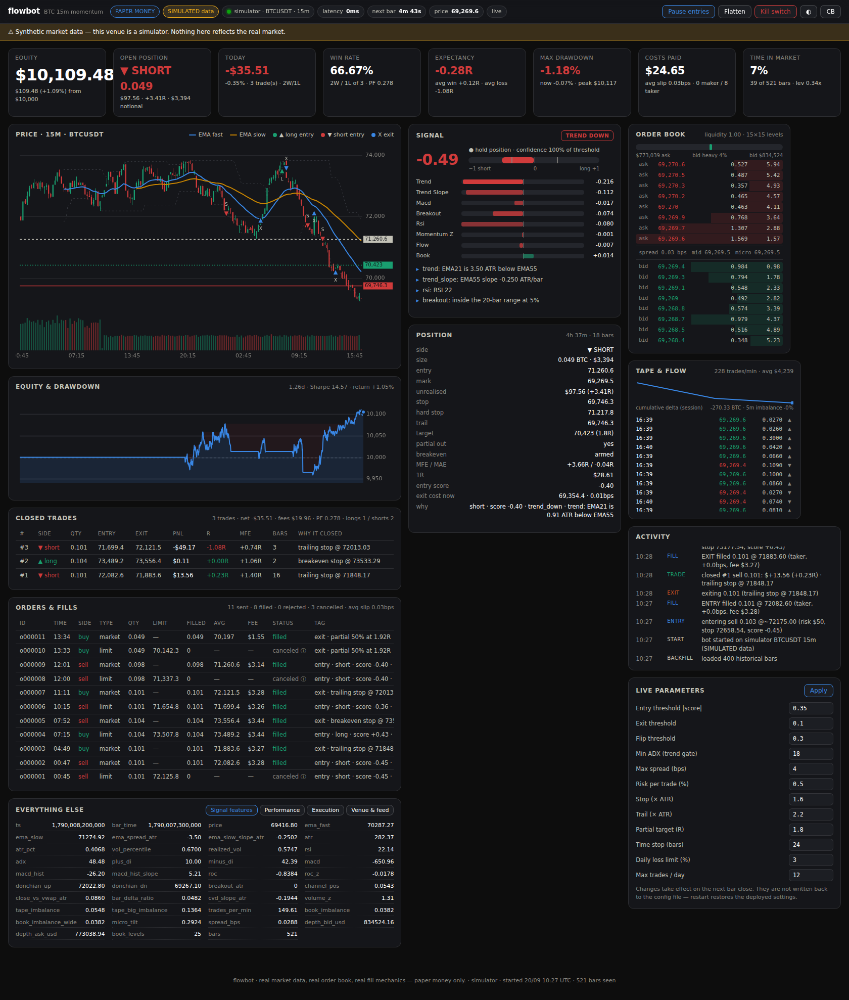

# flowbot — 15m BTC momentum bot

A momentum trading bot that goes with the market flow on the 15-minute BTC
chart: it enters when momentum is real and confirmed, manages the trade on
every print, takes the money when the move pays, then goes back to waiting
for the next signal.

**Everything about the market is real** — the prints, the order book, the
depth each order eats, the queue it waits in, the fees, the latency.
**Only the money is paper.** There is no exchange API key in this repository
and no code path that can sign a real order.



---

## Quick start

```bash
make venv                       # or: python3 -m venv .venv && .venv/bin/pip install -r requirements-dev.txt

make sim                        # offline demo on a synthetic market
make run                        # live Binance USDⓈ-M data, paper money
```

Then open **http://localhost:8033**.

```bash
make test                       # 128 tests
make deploy HOST=user@your-vps  # docker compose on a VPS, dashboard on :8033

# or, when you cannot reach the server, let it update itself:
#   sudo ./scripts/install-autodeploy.sh   (run once, on the server)
```

The simulator is clearly labelled everywhere it appears — the dashboard shows
a banner and `/api/health` reports `real_data: false`. Nothing it produces
says anything about live profitability.

---

## pocketbot (Pocket Option / Pocket Broker)

This repo also holds `pocketbot/`, a separate fixed-time (binary options) bot
for Pocket Option. It runs paper by default, uses demo before real money, and
refuses martingale. Research, maths and setup are in
[docs/POCKETBOT.md](docs/POCKETBOT.md).

```bash
make pocket-sim                      # offline paper demo, no account needed
make pocket-serve                    # bot + dashboard on http://localhost:8040
make pocket-deploy HOST=user@vps     # or Actions -> Deploy to VPS -> app: pocketbot
```

---

## How it decides

Two systems, deliberately separate.

**The signal system** scores eight components into one number in `[-1, +1]`:
EMA separation and slope, MACD, Donchian breakout, RSI, rate-of-change
z-score, order flow (bar delta + CVD + live tape) and resting book imbalance.
Everything in price units is divided by ATR first. Then the gates: ADX ≥ 18
(no chop), price on the right side of the slow EMA (no counter-trend), spread
≤ 4bps, ≥ $150k resting within 10bps, volatility inside a usable band. Each
gate that blocks says so by name.

**The trading bot** turns that into a position. Size comes from the stop
distance — 0.5% of equity at risk against a 1.6-ATR stop — then gets clipped
by the leverage cap and by what the real book can absorb inside the slippage
budget, taking at most half of it because the exit needs liquidity too.

Then it manages, on every print rather than every bar: hard stop, breakeven at
1R, half off at 1.8R, a 2.2-ATR chandelier trail, a 4R ceiling, and a 6-hour
time stop. The level in force is always the tighter of stop and trail. Exits
fire the moment momentum decays below threshold — a momentum trade that has
stopped moving is just risk with no thesis — and a flip straight into the
other side skips the usual cooldown.

Circuit breakers: 3% daily loss limit, 12 trades a day, a kill switch after
four consecutive losses, cooldowns after exits, and an automatic flatten if
the market feed goes stale. Gates only block *entries* — nothing stops the bot
closing a position it already holds.

## How it fills

The part most backtests get wrong, done honestly:

- market orders **walk the real ladder** and pay each level's price;
- an order exists at the venue only after `latency_ms`, and matches the book
  as it is **then**;
- a resting order joins **behind the real resting size** and fills only when
  the real tape trades through that queue;
- liquidity our own order consumed **stays consumed** for a moment;
- if the book cannot fill the size, it **fills partially and cancels** the rest;
- entries are worked passively and **escalate to market on timeout**, paying
  the spread exactly as they would live;
- venue tick size, lot size and minimum notional are the real ones.

## Documentation

| Document | What is in it |
|---|---|
| [docs/ARCHITECTURE.md](docs/ARCHITECTURE.md) | The full system analysis: data flow, the signal model, the risk ladder, what is real vs modelled, and the known approximations |
| [docs/POLYMARKET_PIPELINE.md](docs/POLYMARKET_PIPELINE.md) | The prediction-market pipeline: fair value from the momentum signal, why the tilt is worth 0.3 points and repricing lag is worth 12, the phasing, and the calibration gate |
| [docs/DEPLOY.md](docs/DEPLOY.md) | Running it on a VPS in Docker, securing the dashboard, upgrades |

## Commands

```bash
python -m flowbot run                     # trade paper on the configured venue
python -m flowbot run --sim               # offline simulator
python -m flowbot record --minutes 240    # capture the live feed for backtests
python -m flowbot backtest FILE           # replay it through the same bot
python -m flowbot info FILE               # what is in a recording
python -m flowbot config                  # effective configuration
```

A backtest replays the recorded prints and book depth through **the same**
trader, signal engine and fill simulator the live bot uses — there is no
second engine to disagree with the first — and the report puts costs and
slippage next to the PnL, with a warning when the sample is too small to
mean anything.

## Configuration

`config/flowbot.yml` (live) and `config/sim.yml` (offline). Every field can be
overridden by environment variable, which is how the container is configured:

```bash
FLOWBOT_RISK__RISK_PER_TRADE_PCT=0.25
FLOWBOT_SIGNAL__ENTRY_THRESHOLD=0.40
FLOWBOT_DATA__VENUE=binance-spot
```

## Dashboard

Served on `:8033`, no external CDN, works on a phone. It shows equity and
drawdown, the open position with the stop actually in force and what exiting
right now would cost, the signal score with every component's contribution and
a plain-English reason list, the live depth ladder, the tape with cumulative
delta, every order including the cancelled ones, closed trades with R
multiples, and the raw feature vector. Controls: pause entries, flatten, kill
switch, and live parameter edits.

`GET /api/health` is open for uptime monitors; set
`FLOWBOT_SERVER__AUTH_TOKEN` and everything else needs `?token=…`.

## Layout

```
flowbot/core/        types, config, venue rules, bar clock, event bus
flowbot/data/        venue feeds, book replica, bar aggregation, record/replay, simulator
flowbot/signals/     indicators, features, momentum model, signal engine
flowbot/execution/   paper matching engine, broker with order working
flowbot/bot/         risk, exit ladder, portfolio, stats, SQLite ledger, trader loop
flowbot/backtest/    replay runner and report
flowbot/polymarket/  prediction-market pipeline (read-only, off by default)
flowbot/server/      FastAPI + dashboard
```

---

## What this is not

It is not a money printer, and the repository does not pretend otherwise. It
is an honest simulator wired to a real market: the costs are real, the
liquidity limits are real, and the reported results include the fees and the
slippage that usually get left out. Whether the strategy has an edge is an
empirical question — record a few weeks of real data, backtest it, read the
warnings the report prints, and decide from that.

Paper money only. Live order routing is deliberately unimplemented
(`LiveBroker` raises), because that is a different project with a different
risk review.
